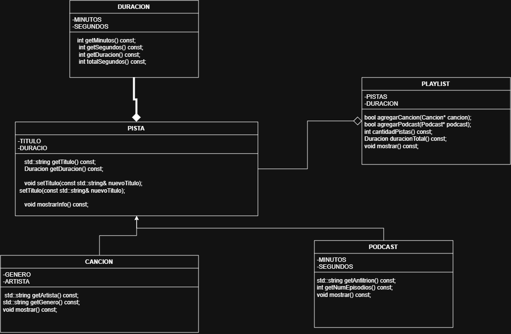

# Práctica 1: Playlist de música

Programación Orientada a Objetos · Ingeniería Mecatrónica · Tercer semestre

Llena cada espacio conforme avances en las fases de [PRACTICA.md](PRACTICA.md).

## Fase 1. Entender el problema

**1.1 El problema con mis propias palabras**

Una app de musica organiza las playlists con musica y podcats, una playlist tiene su nombre, cada pista con su titulo y organizacion, las canciones luego se clasifican por artistas y genero, luego los podcasts se clasifican por anfitrion y  numero de episodios

[Inserta aquí tu respuesta]

**1.2 Sustantivos (posibles clases) y verbos (posibles métodos)**

Sustantivos: Cancion, Podcast, PLaylist, Pista,

Verbos: Titulo, Nombre,Artista, Genero , Anfitrion y numero de episodios

**1.3 Relaciones** (completa con "es un", "tiene un" o "usa un")

*   Una canción es una pista.
*   Un podcast es una pista.
*   Una pista tiene una duración.
*   Una playlist usa una canción.

## Fase 2. Diseñar la solución

**2.1 Diagrama de clases**

**2.2 Justificación de cada relación**

| Relación | Tipo | ¿Por qué? |
| --- | --- | --- |
| Cancion - Pista | __Es una__ | _Es algo que se puede reproducir___ |
| Podcast - Pista | ___Es una_ | __Es algo que se puede reproducir__ |
| Pista - Duracion | ___Tiene una__ | __Info_ |
| Playlist - Cancion | __Usa__ | ___Almacena las canciones__ |
| Playlist - Podcast | __Usa__ | ___Almacena los podcasts__ |

## Fase 3. Implementar

**3.1 Bitácora de dudas**

| # | Duda | Cómo la resolví | Fuente |
| --- | --- | --- | --- |
| 1 | ___Llamar al constructor de Pista desde la lista de inicialización__ | _____ | _____ |
| 2 | ____Intentar no modificar la variable en la clase_ | _this->____ | _____ |
| 3 | _____ | _____ | _____ |

**3.2 Experimentos guiados**

Experimento 1, orden de construcción y destrucción: _____

Experimento 2, ¿quién es dueño de quién?: _____

Experimento 3, un objeto en dos playlists: _____

## Fase 4. Probar y mejorar

**4.1 Tabla de pruebas**

| # | Caso | Resultado esperado | Resultado obtenido | ¿Pasa? |
| --- | --- | --- | --- | --- |
| 1 | Duración normal `Duracion(3, 45)` | 3:45 | _____ | _____ |
| 2 | Segundos mayores a 59 `Duracion(0, 75)` | 1:15 | _____ | _____ |
| 3 | Valores negativos `Duracion(-2, 10)` | 0:00 | _____ | _____ |
| 4 | Título vacío | "Sin título" | _____ | _____ |
| 5 | Playlist vacía | 0:00 y 0 pistas | _____ | _____ |
| 6 | Canción duplicada | La segunda vez devuelve `false` | _____ | _____ |
| 7 | Puntero nulo | Devuelve `false` | _____ | _____ |
| 8 | Total con 2 canciones y 1 podcast | Suma correcta en m:ss | _____ | _____ |

**4.2 Bitácora de mejoras**

| # | Falla o mejora detectada | Qué cambié | Por qué |
| --- | --- | --- | --- |
| 1 | _____ | _____ | _____ |
| 2 | _____ | _____ | _____ |

Retos opcionales que intenté: _____

## Fase 5. Publicar en GitHub

**5.1 Enlace a mi fork**

[Inserta aquí el enlace a tu fork]

## Cierre y reflexión

**6.1 ¿Qué aprendiste en esta práctica?**

[Inserta aquí tu respuesta]

**6.2 ¿Qué cambiarías de tu proceso la próxima vez?**

[Inserta aquí tu respuesta]